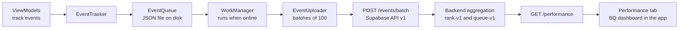
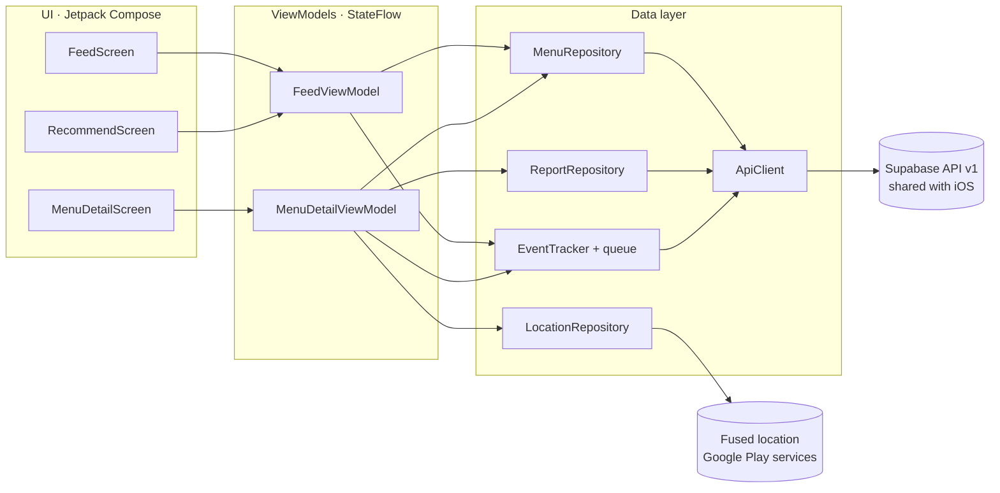
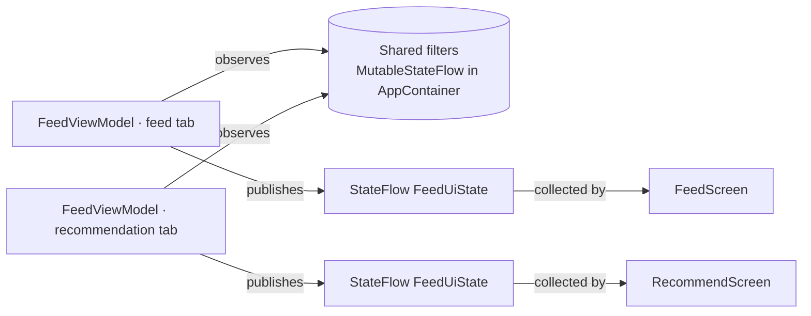
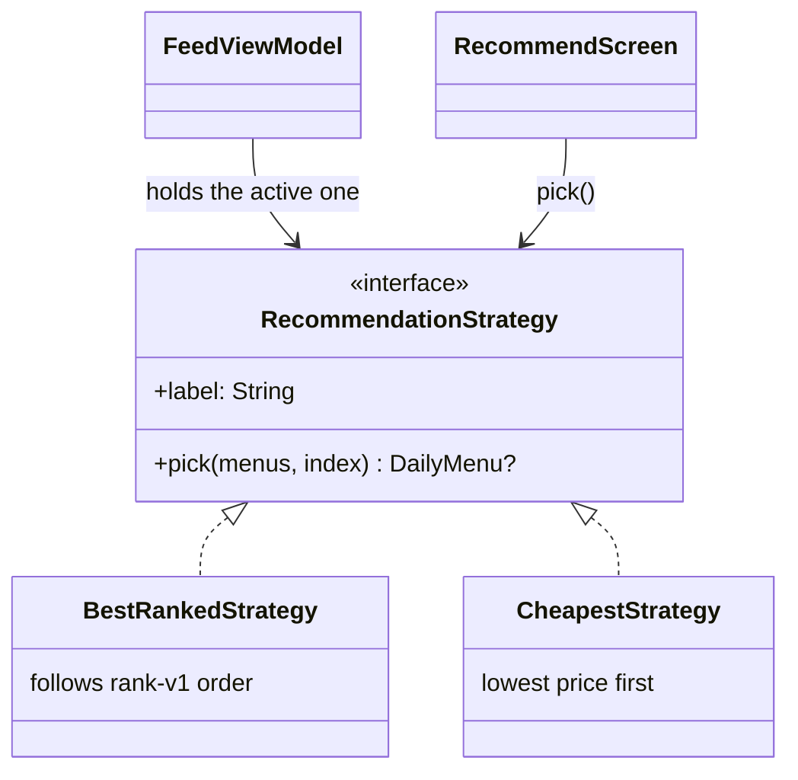

# UniEat for Android

UniEat is a Jetpack Compose app for finding the daily menus published by small restaurants near Universidad de los Andes. It is the Android client of the UniEat project. It shares the same Supabase API v1 and the same product decisions as the iOS app, so a menu published from one platform is visible on the other. The app can run as a local demo with seeded data or connect to the shared backend.

This README covers the Sprint 2 deliverable items for the Android client. It lists the business questions with their type and rationale, the implemented functionalities and views with their owners, the analytics pipeline, and the architecture with its diagrams, patterns and tactics. The rubric mapping, architecture and design patterns, data pipeline and presentation walkthrough are documented in `docs/sprint2-sustentacion.md`.

Team members on this client are Camilo Molina, Juan José Murillo and Samuel David Rozo.

## Run in Android Studio

Requirements are Android Studio with an Android emulator or a device on Android 8 or later. The project compiles against SDK 35 with Java 17, both bundled with current Android Studio versions.

1. Open the `UniEat-Android` folder in Android Studio and let Gradle sync. Android Studio writes `local.properties` with your SDK path on its own.
2. Create an emulator in Device Manager if you do not have one. Any Pixel image works.
3. Select the `app` run configuration and press Run.

You do not need an account, API keys or a running backend to explore the app. When `local.properties` has no Supabase values, debug builds switch to an in-memory copy of the backend seed data. Tap the demo entry button on the welcome screen and browse from there. A banner on each screen reminds you that the data is fake.

To run the unit tests

```sh
./gradlew :app:testDebugUnitTest
```

They run on the JVM, without an emulator. The suites cover the feed and detail ViewModels, the recommendation strategies, the wait evidence rule, the filters, the location and proximity decisions, the analytics queue, and the HTTP contract against recorded API samples.

## Connect to the shared backend

Copy `local.properties.example` into `local.properties`, which git ignores, and fill in

```
supabase.url=https://<project-ref>.supabase.co
supabase.publishableKey=sb_publishable_xxx
```

Use `http://10.0.2.2:54321` as the URL to reach a local `supabase start` from the emulator. These are client-side values. Never put a secret or service-role key here.

The Login feature is not built yet, so debug builds sign in to Supabase Auth with a test account taken from `dev.email` and `dev.password` in `local.properties`, with defaults matching the backend integration tests. That helper is compiled only into debug builds. In any build, when the backend answers that the session is no longer valid, the feed sends the user back to the login screen and clears the navigation stack.

## Business questions

| Team member | Business question | Type | Rationale |
| --- | --- | --- | --- |
| Camilo Molina | BQ-05 | | Space reserved for Camilo Molina |
| Juan José Murillo | BQ-06. How long would a student wait in line, and how reliable is that estimate? | Type 2 | Lunch decisions happen inside a fixed break, so the wait matters as much as the price. The estimate aggregates community wait reports on the backend, and the app must be explicit about how much evidence backs it instead of showing a number that looks exact. |
| Samuel David Rozo | | | Space reserved for Samuel David Rozo |

The questions are implemented on top of the analytics pipeline described below. Impressions, detail opens, selections, arrivals and community reports are the raw signals the backend aggregates to answer them.

How BQ-06 looks in the app. The backend sends `waitMinutes`, `waitSampleCount` and `waitNewestReportAt`. The feed cards and the detail show "~N min de fila" only when the queue-v1 evidence rule holds, which asks for at least three reports with the newest within 30 minutes, and show "Fila sin datos" otherwise. No number is ever made up on the client.

## Implemented functionalities

| Rubric item | Functionality | Owner |
| --- | --- | --- |
| a. Sensor | Space reserved for Camilo Molina | Camilo Molina |
| b. Type 2 BQ | BQ-06 wait estimate with its evidence level in the feed and the detail. Each member also documents their own question here. | Juan José Murillo |
| c. Context aware | Space reserved for Camilo Molina | Camilo Molina |
| d. Smart feature | The recommendation tab. One menu taken from the backend rank-v1 options, with the backend explanation of why, interchangeable selection criteria and a button to ask for another option. | Juan José Murillo |
| e. Authentication | Pending. Today a debug-only test account signs in to Supabase Auth, and an expired session redirects the feed to the login. The full Login feature is the next milestone. | To be assigned |
| f. External services | Space reserved for Camilo Molina | Camilo Molina |

Other functionality shipped this sprint on the feed slice. The filter sheet with the five parameters `GET /feed` accepts, shared between tabs. Live expiry, where menus disappear when their valid-until time passes, judged with the server clock. Per-state screens for loading, empty, offline, server error and expired session. The functionalities owned by Samuel David Rozo will be added to this table.

## Implemented views

| View | What it shows | Owner |
| --- | --- | --- |
| Feed tab | Menus in rank-v1 order. Each card has restaurant, dish, price, area, the BQ-06 wait sticker, a near-expiry warning and the backend explanation. | Juan José Murillo |
| Filters sheet | Budget slider plus time, diet, area and payment chips. A local draft applied only when the user confirms. | Juan José Murillo |
| Recommendation tab | Active filters summary, criterion chips, the recommended menu with its explanation and a button to ask for another option. | Juan José Murillo |
| Performance tab | The BQ dashboard. The metrics from `GET /performance` on one screen, with a period selector of 7 or 28 days, a notice when the backend marks the data as insufficient, and a restricted state for accounts without access. Each member adds the card of their own question here. | Juan José Murillo |
| Menu detail | Space reserved for Camilo Molina | Camilo Molina |
| Navigation shell and theme | Space reserved for Camilo Molina | Camilo Molina |
| | Space reserved for Samuel David Rozo | Samuel David Rozo |

## Analytics pipeline



The queue, the scheduler and the uploader are owned by Camilo Molina, and their rationale is reserved for him. The feed events on top of the pipeline are owned by Juan José Murillo. The feed records `feed_impression` the first time a card actually becomes visible, once per menu per session, and the detail records `detail_open`, `selection` and `arrival`. Each event gets its id when it is created, so a retried batch can never count twice. In demo mode the same queue and scheduler run against a logging stand-in. Filter Logcat by `UniEatEvents` to watch the events flow.

The other end of the pipeline is visible in the app. The Performance tab is the BQ dashboard, owned by Juan José Murillo. It shows the metrics the backend computes from these events, all on one screen, and the client computes nothing. Role visibility arrives with the Login feature, so today an account without access sees an explicit restricted state instead of the numbers.

## Architecture



The feed slice, meaning the feed, the filters and the recommendation, is owned by Juan José Murillo. The data layer, the navigation shell and the detail slice are owned by Camilo Molina, and the slice owned by Samuel David Rozo will be added to the diagram.

Rationale for the feed slice. MVVM keeps every screen a pure function of a state object, which is what makes the app testable on the JVM. The unit tests run without an emulator because business decisions live in ViewModels and plain Kotlin, never in composables. The data layer hides where data comes from, so the same screens run against the real API or the seeded fake without changing a line of UI. Heavy computation stays on the backend, which does the ranking, the wait aggregation and the report moderation. The client contributes only what the phone alone can know, such as permission state and the local event queue.

Architectural tactics used on this slice. A single error envelope, where every API failure carries the backend error code that drives the UI reaction. The server clock instead of the device clock to judge expiry. Timeouts on every request. Discarding stale responses when the filters change while a request is in flight.

## Design patterns

### Observer, by Juan José Murillo



The ViewModel is the only writer of a sealed `FeedUiState` and the screens are passive observers that re-render on every change. The non-trivial case is the shared filters flow. Both tabs observe the same `MutableStateFlow`, so applying filters in the feed tab reloads the recommendation tab too, and a unit test proves the chain. The reason for the pattern is that the screen never asks for data and never holds business state, which removes a whole class of synchronization bugs and makes every state reachable from a test.

### Strategy, by Juan José Murillo



The recommendation tab delegates the choice to an interchangeable criterion the user switches at runtime. One criterion keeps the backend rank-v1 order and the other picks by the lowest price the backend already sends. The reason for the pattern is that the selection criterion is the one axis of this feature that genuinely varies, and the pattern keeps each criterion a few lines long and independently tested. Neither strategy invents a ranking. The backend still filters, orders and explains, and a strategy only chooses among its results.

### Pattern by Camilo Molina

Space reserved for Camilo Molina.

### Pattern by Samuel David Rozo

Space reserved for Samuel David Rozo.

## Verification status

The unit test suite runs green on the JVM with `./gradlew :app:testDebugUnitTest`. There is no CI workflow in this repository yet, so run the suite before opening a pull request. Before presenting, walk through the demo on an emulator. Browse the feed, change the filters, switch the recommendation criterion, open a detail, send a report and check the metrics on the Performance tab.
