# UniEat Android — Sprint 2 walkthrough

Supporting document for the deliverable and the viva voce. Everything here comes from the repository's code, its git history, and real test runs. Where something is missing, the document says so.

Team members on this client: Camilo Molina, Juan José Murillo and Samuel David Rozen Mogollon.

---

## 1. Summary of the work

The Android client consumes the same Supabase API v1 as the iOS app. What is working, with tests, after this sprint:

**By Camilo Molina** (commits "Base android" and "Fase 1–5" of menu-detail-location, plus follow-ups):

- Project base: tab navigation, visual theme, reusable components (cards, stickers, buttons), HTTP client, and the contract models.
- Menu detail with **BQ-05** (location references): location card with an OpenStreetMap view, address, entrance description, and an explicit warning when references are missing or disputed by pending reports.
- The **GPS sensor** in the detail: live walking distance to the restaurant, a "Tú" marker on the map, and the "¿Ya llegaste?" prompt within 50 meters. Context-aware for real: a different UI for each permission and GPS state.
- Community reports (`POST /reports`) from the detail.
- The **analytics pipeline**: event queue persisted on disk, WorkManager to drain it when online, batched upload to `POST /events/batch`.
- Backend connectivity: `ApiClient` with the API error envelope and authenticated access tokens supplied by `SessionManager`.

**By Juan José Murillo** (commits "Fase 1–3" of the feed, Strategy, and the dashboard, on the feed-today branch):

- The **"Hoy" feed**: the real menu list in the backend's rank-v1 order, built with MVVM and StateFlow.
- **BQ-06** (waiting time): the backend's queue estimate shown with its evidence level.
- The **filters** `/feed` accepts (budget, time, diet, area, payment method), shared between tabs.
- The smart feature **"Elige por mí"**: a recommendation from the backend ranking with its explanation, plus the **Strategy** pattern with two interchangeable criteria.
- The **expired-session redirect** to the login (`AUTH_REQUIRED`).
- The **`feed_impression`** events (deduplicated per session) on top of the existing pipeline.
- The **metrics dashboard** in the "Rendimiento" tab (`GET /performance`).

**Samuel David Rozen Mogollon:**

- Supabase email/password Login and sign-out.
- Persisted session through `SessionStore` and transparent token refresh through `SessionManager`.
- `GET /me` profile screen with loading, content, error and retry states.
- **Proxy** pattern: `ApiClient` depends on `AccessTokenProvider`; `SessionManager` decides whether to return, restore or refresh a token.
- BQ-01 client instrumentation records feed-loading outcomes, connection, device, OS and request-to-render timing. Cross-device aggregation still depends on a shared backend ingestion endpoint.
- Sensor contribution: shake-to-refresh uses the accelerometer only while the feed is resumed and does not start a second request while loading.
- Smart-feature contribution: “Menor fila” reuses BQ-06’s evidence rule and ranks only supported wait estimates using the server-aligned clock.
- Context-aware contribution: tabs adapt to the authenticated role from `GET /me`; profile loading has an explicit retry state.

---

## 2. Architecture

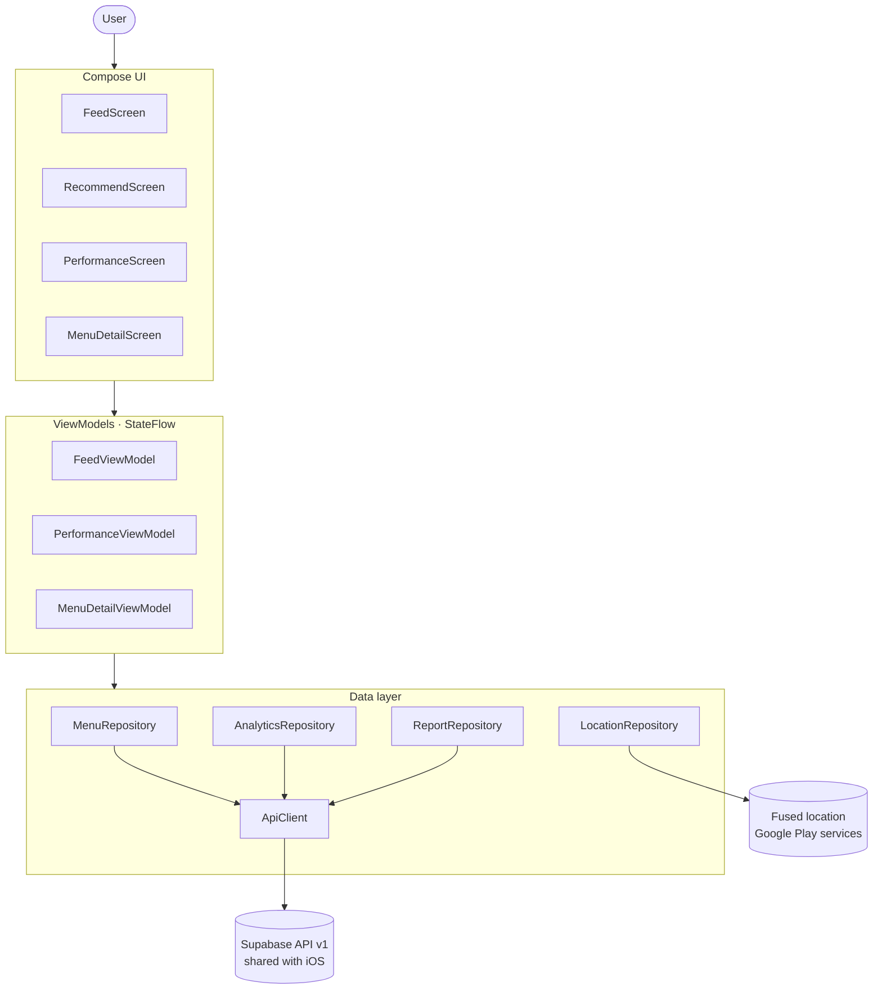

One sentence per block. The UI only draws what the state says and never touches the network. The ViewModel is each screen's brain: it fetches, decides the state, and publishes it. A Repository is a contract: in debug without a backend it answers with a copy of the seed data, with a backend it calls the real API, and screens cannot tell the difference. `ApiClient` is the only piece that knows HTTP.

Dependency injection is manual: `AppContainer` builds one instance of each piece and ViewModel factories read from it. No Hilt, because with this size a hand-made container is easier to explain and to test.

**Why this shape**: unit tests run on the JVM without an emulator because business decisions live in ViewModels and plain Kotlin rather than composables. Heavy computation (ranking, wait aggregation, report moderation) stays on the backend; the client contributes only what the phone alone knows: GPS, permission state, and the local event queue.

---

## 3. The "Hoy" feed — Juan José

**Problem it solves**: a student needs to see, fast, which lunches are available nearby, ranked by relevance, without guessing.

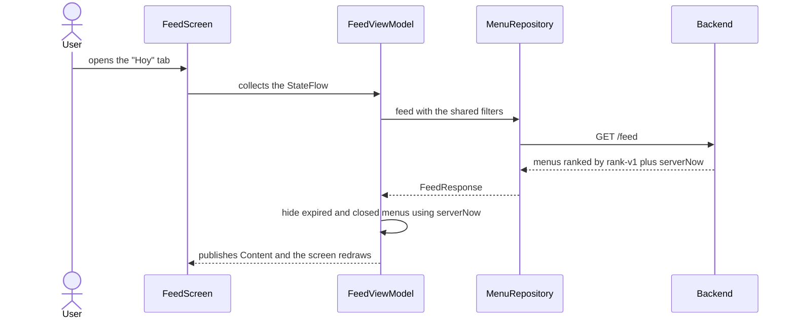

**What each card shows**: restaurant, dish, price, area, the BQ-06 wait sticker, "Menú por vencer" within 30 minutes of expiry, "Reporte pendiente" when there are any, and the `explanation` string with which the backend justifies the ranking position.

**Screen states**, each with its own visual answer: loading, content, no menus matching the filters, no connection with a retry button, server error with its message, and expired session which navigates to the login.

**A detail worth points**: freshness is judged with the server clock, not the phone's. Each response carries `serverNow`; we keep the offset against the device clock and a shared minute ticker (`rememberServerNow`) re-evaluates, so a menu that expires while on screen disappears on its own.

**Files**: `ui/feed/FeedViewModel.kt` (states and logic), `ui/feed/FeedScreen.kt` (the screen), `ui/common/ServerClock.kt` (the minute ticker, shared with the detail).

---

## 4. BQ-06 — Waiting time — Juan José

**The question**: how long would a student wait in line here, and how reliable is that estimate?

**Who does what**: the backend aggregates the community's wait reports and sends three fields per menu: `waitMinutes` (the estimate), `waitSampleCount` (how many reports), `waitNewestReportAt` (the newest one). Android **computes nothing**: it only decides whether the evidence is enough to show the number.

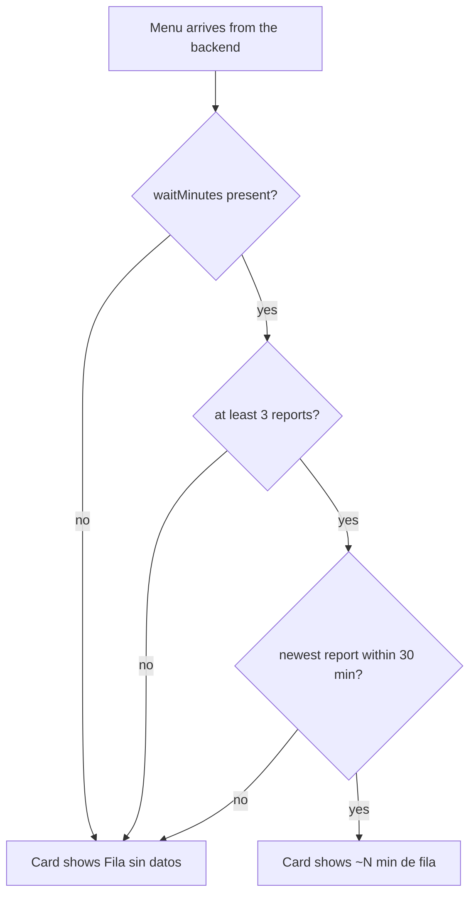

The rule as it exists in `core/model/Models.kt`:

```kotlin
/** queue-v1 freshness: >= 3 samples and newest report at most 30 minutes old. */
fun hasWaitEvidence(at: Instant = Instant.now()): Boolean {
    val newest = waitNewestReportAt ?: return false
    if (waitSampleCount < 3 || waitMinutes == null) return false
    return newest <= at && Duration.between(newest, at) <= Duration.ofMinutes(30)
}
```

**What the user sees**: with evidence, a green "~9 min de fila" sticker on the feed card, and in the detail the big number with how many reports back it and the time of the newest one. Without evidence, "Fila sin datos". A number is never made up, and a stale estimate is never presented as reliable.

**Where it lives**: the rule in `DailyMenu.hasWaitEvidence`, the sticker in `WaitSticker` inside `FeedScreen.kt`, the detail card existed already (Camilo). Tests in `WaitEvidenceTest`, five cases including the exact 30-minute edge.

---

## 5. Filters — Juan José

The five parameters `/feed` really accepts, none invented: budget (5,000–40,000), available time (15/30/45/60), diet (all/vegetarian/vegan), area (Centro/Norte/Sur/Fuera del campus), payment method. Null values are omitted from the query.

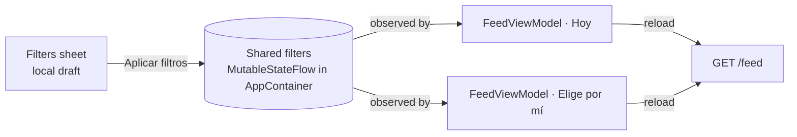

**Race protection**: the flow is observed with `collectLatest`, so if the user changes filters while a request is in flight, that request is cancelled and a stale response can never overwrite the new one. iOS does this guard by hand; in Kotlin it is one word.

**Files**: `ui/feed/FiltersSheet.kt` (the sheet), `AppContainer.kt` (the shared flow, one line), `FeedViewModel.kt` (observation and reload). Key test: `applyingFiltersInOneTabReloadsTheOtherTab`.

---

## 6. "Elige por mí" — smart feature — Juan José

**What it does**: picks today's lunch for the student, using the ranking the backend already computed.

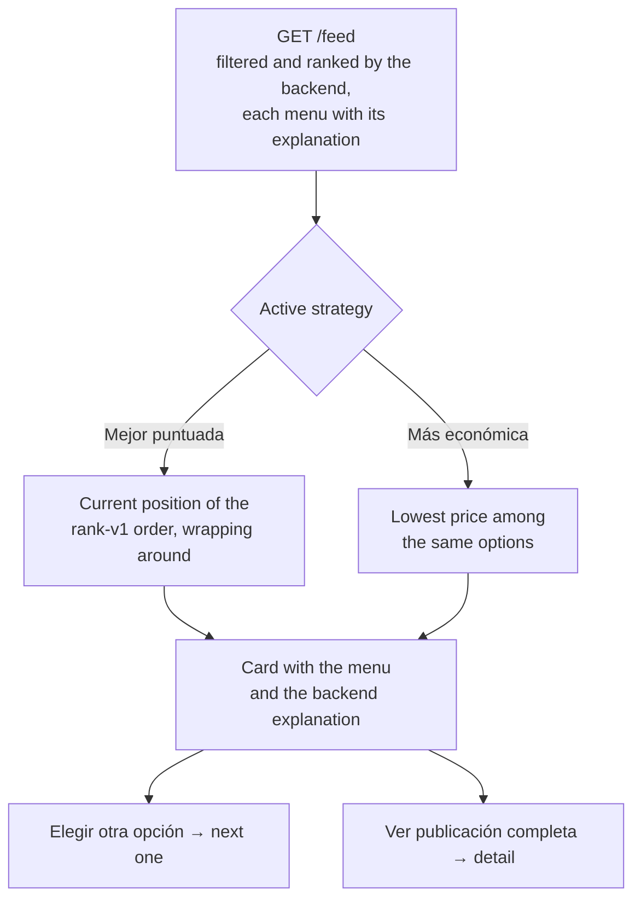

**Where the "why" comes from**: the `explanation` field the backend sends per menu, shown as-is. **There is no local ranking**: the backend filters, orders, and explains; a strategy only chooses among results already delivered, using fields that already arrive (position and `lowestPriceCop`).

**Edge cases**: with no compatible menus, the empty state suggests changing filters; with no connection, the clear error with retry; with an expired session, the login. Switching criterion or reloading goes back to that criterion's best option.

**Files**: `ui/feed/RecommendScreen.kt`, `ui/feed/RecommendationStrategy.kt`, and the part of `FeedViewModel` that holds the active strategy and the index.

---

## 7. GPS — Camilo, in the detail

The sensor lives in the menu detail screen.

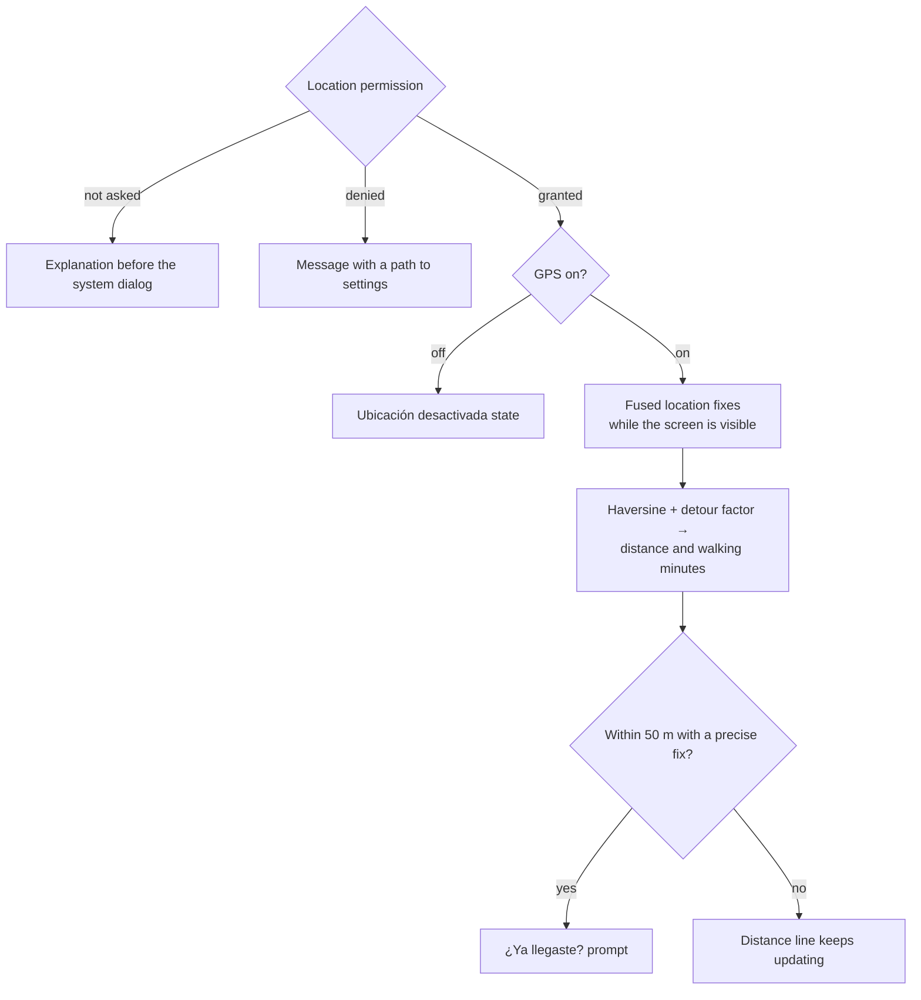

Context-aware for real: each permission and GPS situation has its own visual state, and the sensor stops by itself when the screen goes to the background (`WhileSubscribed`). The location never leaves the phone.

Scope note: during the sprint, sending the location as `origin` to `/feed` was also implemented and then reverted when responsibilities were split (the sensor belongs to BQ-05 in the detail). It remains in git history as evidence of work, but **it is not in the current code**.

**Files**: `data/location/FusedLocationRepository.kt`, `core/decision/Proximity.kt`, and the distance section in `ui/detail/`.

---

## 8. EventTracker and the pipeline — Camilo the infrastructure, Juan José the feed events

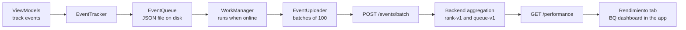

Events the app records, none invented:

- **`feed_impression`** (Juan José): fires the first time a menu card is composed in the feed list, meaning it actually entered the screen. A `Set` in the ViewModel deduplicates it: one impression per menu per session, even scrolling back and forth. Test: `impressionIsTrackedOncePerMenu`.
- **`selection`** (already existed, in the detail): fires on "Elegir este menú", the student's final decision. We verified it covers selections that start in the feed, so nothing was duplicated.
- `detail_open` and `arrival` also exist in the detail (Camilo).

Why a disk queue: a student without signal is the normal case on campus. Events survive the app being closed, and since each event is born with its id, a retried batch can never count twice (the server deduplicates by id).

---

## 9. Metrics dashboard — Juan José

The "Rendimiento" tab is the other end of the pipeline: one screen with the metrics the backend computes via `GET /performance?days=7|28` — impressions, detail opens, selections, reported arrivals — and a period selector. The client computes no metric. If the backend flags `insufficientData`, the screen says so instead of presenting numbers as reliable; if the account has no role for the endpoint (it belongs to restaurants and admins), it shows "Acceso restringido" with the backend message instead of breaking.

**Files**: `ui/performance/PerformanceViewModel.kt`, `ui/performance/PerformanceScreen.kt`, and the `performance(days)` method added to the existing `AnalyticsRepository` (no new repository). Each member will add their BQ's card here.

---

## 10. Design patterns

### Observer — Juan José

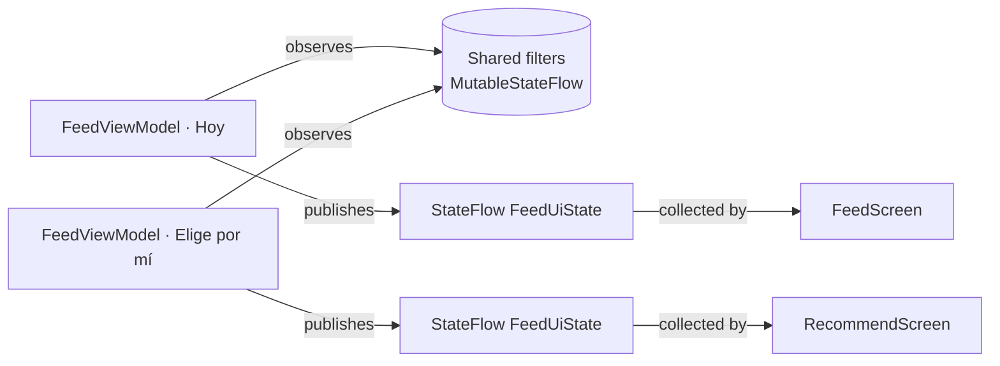

`StateFlow` is a box that holds a value and notifies whoever watches it when it changes. What we designed, beyond the library: the sealed state contract (only one state can exist at a time), the ViewModel as the single writer, and the non-trivial case of two ViewModels observing the same filters flow, proven by a unit test.

### Strategy — Juan José

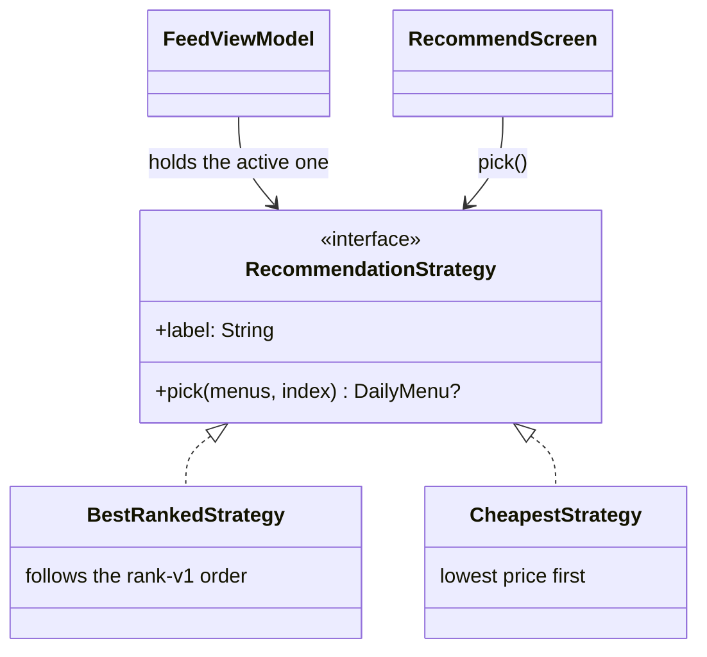

Two implementations a few lines each, interchangeable at runtime with the chips in "Elige por mí". A hand-implemented pattern, not an annotation or a library piece: our interface, our implementations, each with its own test.

### Repository — Camilo

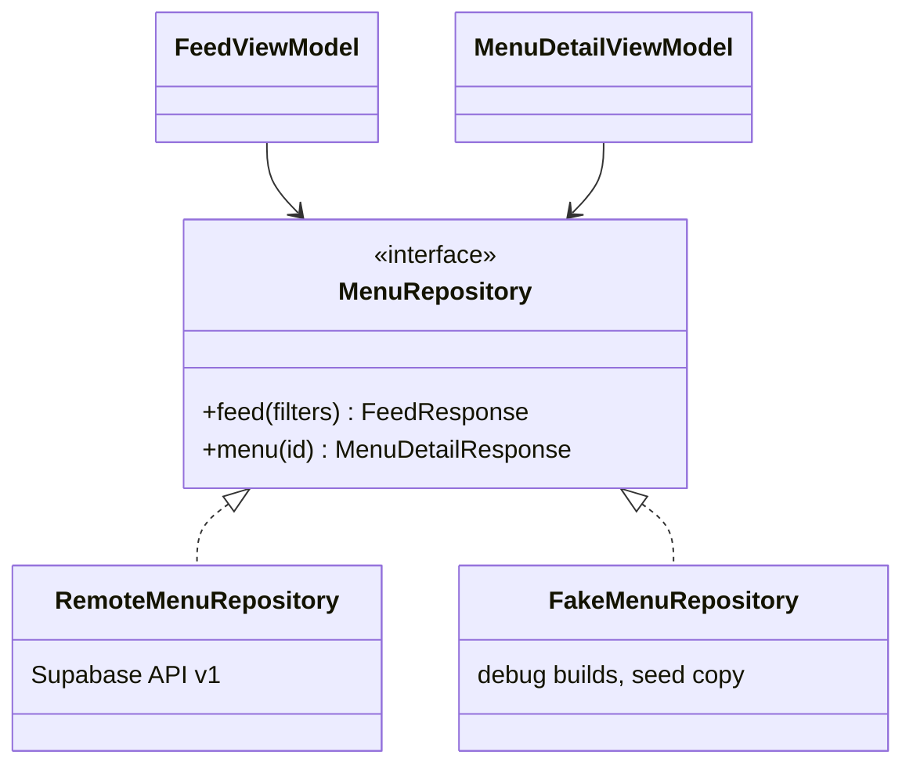

ViewModels depend on the contract, never on HTTP. The remote implementation adapts the API; the debug fake answers with seeded data and the same error codes (404, 410, 403). This is what makes stub-based tests and the demo mode possible.

### Proxy — Samuel David Rozen Mogollon

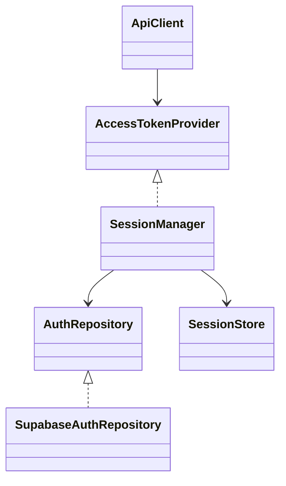

The problem is token lifecycle coupling. Without this proxy, every repository would need to know whether the access token is valid, when it expires, and how to refresh it. `SessionManager` centralizes that decision behind the existing `AccessTokenProvider` interface. It restores the persisted session, refreshes within a one-minute margin, and uses a `Mutex` so concurrent API requests do not trigger duplicate refreshes. A failed authentication refresh clears the local session and moves the app to `SignedOut`.

Known limitation: DataStore preferences persist the refresh token but do not encrypt it at rest. This must be addressed before production use.

---

## 11. Tests and validation

Run with `./gradlew :app:testDebugUnitTest` on the JVM without an emulator. The suite has **112 tests**: the 88 from the feed and detail slices plus 24 from Samuel's slice.

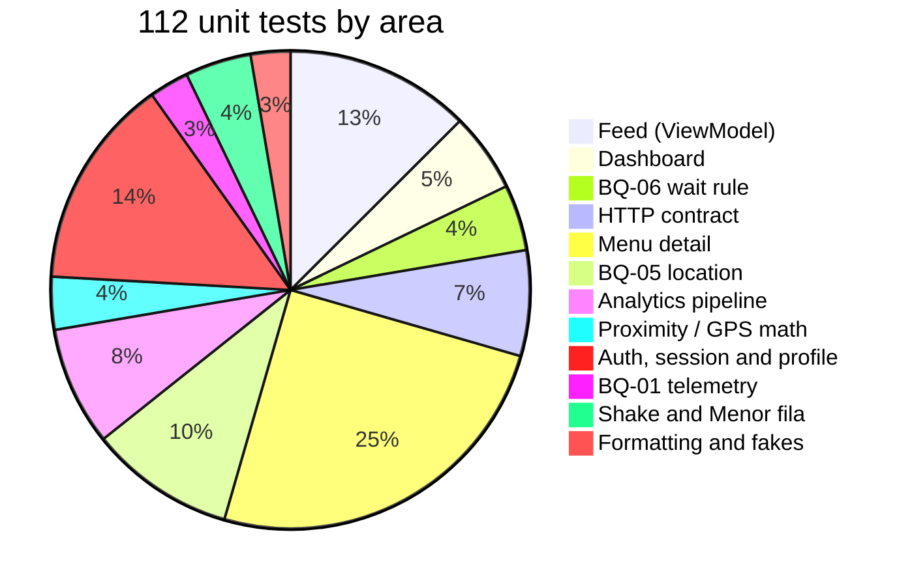

| Suite | What it proves | Tests | Result |
| --- | --- | --- | --- |
| FeedViewModelTest | Backend order kept, expired/closed hidden, empty, error+retry, clear offline, expired session, shared filters across tabs, both strategies, single impression | 14 | PASS |
| PerformanceViewModelTest | Summary, period switch without extra loads, restricted access, expired session, error+retry, insufficient data passed through | 6 | PASS |
| WaitEvidenceTest | The 3-reports / 30-minutes rule, including the exact edge | 5 | PASS |
| ApiContractTest | Headers, query parameters, feed and performance decoding, error envelope | 8 | PASS |
| MenuDetailViewModelTest | Detail states, 410, events | 9 | PASS |
| MenuDetailDistanceTest | Permissions, distances, arrival | 9 | PASS |
| MenuDetailReportTest | Community reports | 10 | PASS |
| LocationGuidanceTest | BQ-05 references and warnings | 11 | PASS |
| EventPipelineTest | Queue, uploader, deduplication, bounds | 9 | PASS |
| ProximityTest | Haversine and walking minutes | 4 | PASS |
| SpanishPresentationTest, FakeReportLoopTest | Formats and fakes | 3 | PASS |
| SessionManagerTest | Token reuse, single refresh for concurrent callers, auth failure clears the session, server failure keeps it, logout offline | 5 | |
| SupabaseAuthRepositoryTest | Password grant contract, bad credentials, rate limit, server error | 4 | |
| LoginViewModelTest | Validation before calling auth, loading to success, double tap ignored | 2 | |
| ProfileViewModelTest | Profile content, error and retry | 2 | |
| AppShellViewModelTest | Role error and retry, demo profile, no reload on token refresh | 3 | |
| ShakeRefreshControllerTest | Shake threshold and throttle | 3 | |
| RecommendationStrategySamuelTest | "Menor fila" order and BQ-06 evidence rule | 2 | |
| FeedLoadTelemetryTest | p95, grouping, failure rate with abandoned loads apart | 3 | |

There are no instrumented UI tests (Compose/emulator); visual validation is done by hand on the emulator with the demo data.

**Real bugs the tests caught during development** (and their fixes):

1. A test stub fell into infinite recursion (`StackOverflowError`) when a field and a function ended up with the same signature; the suite caught it immediately and the field was renamed.
2. The filters draft used `rememberSaveable` with a class that is not Parcelable, which would have crashed at runtime; it was changed to `remember`, accepting that a rotation closes the draft.

---

## 12. Implementation decisions

- **No client-side ranking or metrics**: the backend already orders, explains and aggregates; duplicating that would mean inventing data and drifting away from iOS.
- **Server clock for freshness**: the phone clock can be wrong; `serverNow` comes in every response, the same decision the detail and iOS made.
- **Shared filters through one flow in the container**: the alternative (passing filters through navigation or duplicating them per tab) desynchronizes the screens; one `MutableStateFlow` keeps them identical and is trivial to test.
- **`collectLatest` to cancel stale loads**: the race guard in one word.
- **Strategy on the recommendation and nowhere else**: it is the only spot in the feed with genuinely interchangeable criteria; anywhere else it would be decorative.
- **Offline as a clear error, not a cache**: a team scope decision; the context-aware behavior of this deliverable lives in the detail with the GPS.
- **Extending `AnalyticsRepository` for the dashboard** instead of creating another repository: same data family, zero duplication.

